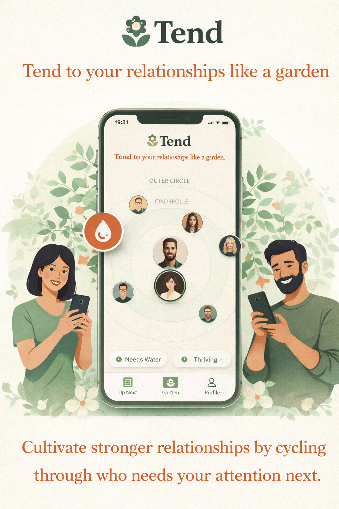
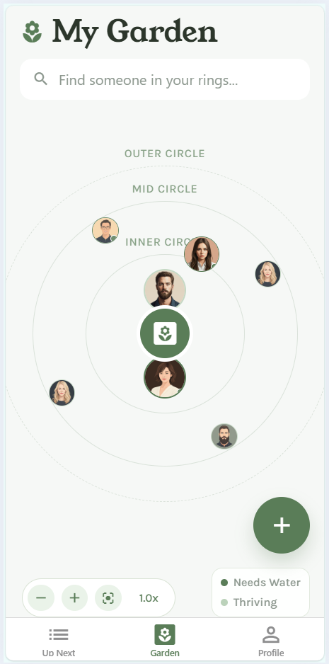
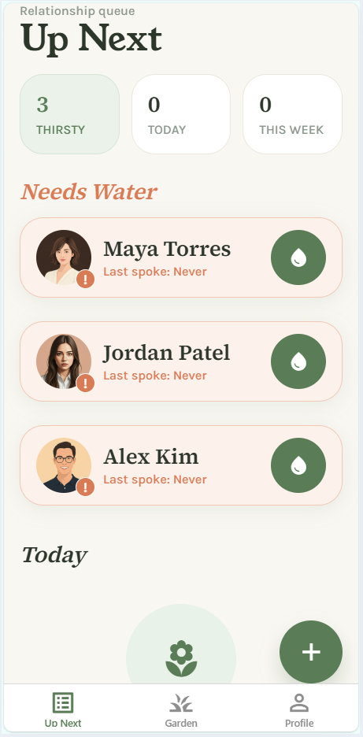

    

# Tend

Tend is an open-source mobile app for people who want to stay close to friends and family without relying on memory.

Life gets noisy. You forget to call, text, and check in, even when relationships matter deeply.
Tend treats your social circle like a garden: relationships need regular watering to stay healthy.

Instead of asking "who should I reach out to next?", Tend cycles your contacts, highlights who is overdue, and helps you take action fast.

## Features

- Garden-style contact view with Inner, Mid, and Outer circles
- Up Next feed that surfaces overdue people first
- One-tap "Water" actions to log interactions quickly
- Contact import and contact-event syncing
- Daily reminder notifications with configurable timing
- On-device storage with export - Stored locally on your device, not in the cloud. Export supported.

## Releases

Install the app from the [releases page](https://github.com/Shahar-DeepElegant/tend/releases).

## Images

## Contributing

This project is open source and welcomes contributions. See `DEV.md` for details.

## License

This project is licensed under the MIT License. See `LICENSE`.
